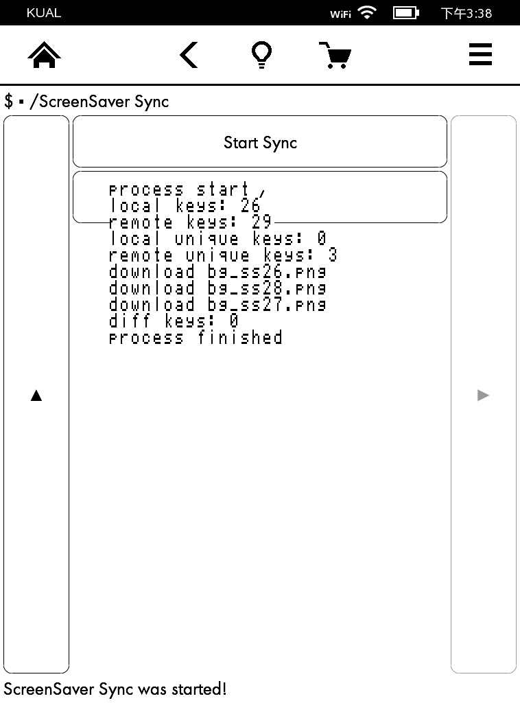

# kual-screensaver-sync

依赖于 KUAL 的 Kindle 插件，用于从 GitHub 同步屏保图片给 ScreenSavers Hack 插件。

同步逻辑：

1. 删除本地有，远程没有的屏保；
2. 下载远程有，本地没有的屏保；
3. 如果一张屏保本地和远程的 md5 值不一样，本地文件将被远程文件覆盖。

**注意：** 目前远程屏保是固定从 <https://github.com/mzlogin/kindle-paperwhite-screensavers> 的 built 分支拉取的，地址写死在代码里面。

若需要使用其它地址，服务器上需要有以下文件结构：

```
├── meta.json
└── screensavers
    ├── bg_ss00.png
    ├── bg_ss01.png
    ├── bg_ss02.png
```

meta.json 文件里记录 screensavers 里每个 png 文件的最新 md5 值。

## 安装方法

该插件依赖于 KUAL 和 Python3，请确保以前已经正确安装它们。本插件同步下来的屏保图片用于 ScreenSavers Hack 插件，所以也必须安装该插件，同步下来的屏保图片才能起作用。

本插件安装方法：

1. 下载本项目代码，可以用 git clone，也可以到 [releases](https://github.com/mzlogin/kual-screensaver-syn/releases) 下载；

2. 将 Kindle 用数据线连接电脑，把上面下载的代码里的 screensaver-sync 文件夹拷贝到 Kindle 的 /mnt/us/extensions 目录下。

## 使用方法

1. 打开 KUAL，就可以在插件列表里看到「ScreenSaver Sync」菜单项了；

2. 点击后可进入插件功能列表；

3. 点击「Start Sync」可以开始同步。

## 运行截图



## 适用机型

当前只在 Kindle PaperWhite 一代、三代上运行过，其它机型未验证，理论上都兼容。

- Kindle PaperWhite
- Kindle PaperWhite 3

## License

[MIT License](./LICENSE)
